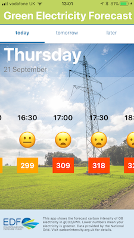

# GridForecast

[]() [](https://dependencyci.com/github/carbon-intensity/GridForecast)
[]()
[]()

A demonstration app for the [National Grid carbon intensity API](http://carbonintensity.org.uk/), built in React Native.



## Development

### Requirements

* NodeJS
* Yarn

### Running the app

The app uses [Expo](http://expo.io/) for development. Install the Expo app on your phone, then run:

```
yarn install
yarn start
```

Scan the QR code with the Expo app, and away you go.

### Building Releases

The build process is also set up to use Expo. Read the [Expo documentation](https://docs.expo.io/versions/latest/guides/building-standalone-apps.html) for details on the process, but in summary:

```
yarn run exp login
yarn run exp start
yarn run exp build:ios | build:android
yarn run build:status
```

## Using the carbon intensity API

The sample code that actually calls the carbon intensity API is in the `/jsx/ForecastDayView.js` file.

## Credits

* Application icon: ["Energy"](https://thenounproject.com/korawan_m/collection/green-energy-ecology/?i=1014183) by [BomSymbols](https://thenounproject.com/korawan_m/) from the [Noun Project](https://thenounproject.com/)
* Background image: ["Road Under Power Line Electricity Pylons"](https://picjumbo.com/road-under-power-line-electricity-pylons/) by [Victor Hanacek](https://picjumbo.com/about-viktor-hanacek/) from [PicJumbo](https://picjumbo.com/)
